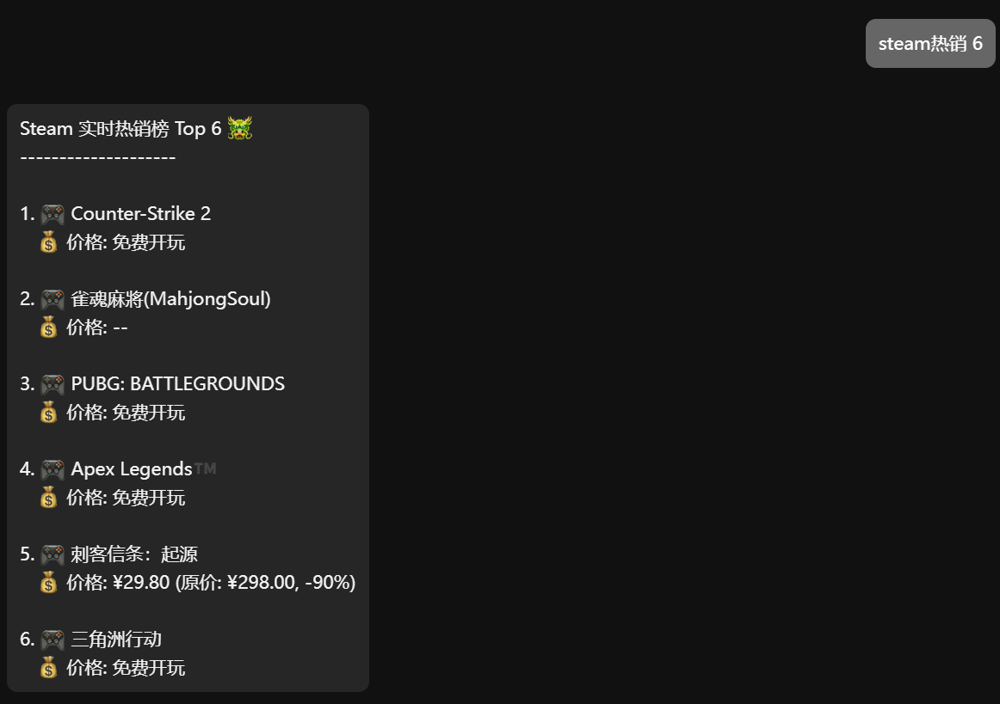

# 🎮 Steam 热销榜插件 astrbot_plugin_steam_topsellers

## v2.0.1

这是一个用于获取 Steam 热销榜排名的插件。它支持将排名日报定时发送到指定的群组或私聊会话，输出经过美化并使用人民币(CNY)作为价格单位。

## 访问统计

## 

## ✨ 主要功能

- **热销榜查询：** 随时获取 Steam 实时热销榜排名。
- **定时日报：** 支持将每日热销榜日报定时发送到已订阅的会话。
- **订阅与取消订阅：** 用户可以在群组或私聊中订阅/取消订阅每日日报。
- **全局订阅列表：** 管理员可以查看所有已订阅每日日报的群组和私聊会话列表。
- **美化输出：** 价格信息经过智能解析和格式化，支持显示原价和折扣。

## 指令说明

以下是本插件支持的指令：

| 指令                                 | 别名                                                      | 功能说明                                               | 权限     |
| :----------------------------------- | :-------------------------------------------------------- | :----------------------------------------------------- | :------- |
| `/steam热销 [数量]`                  | `steam热销榜`, `steam热销排行`                            | 输出 Steam 实时热销榜排名，可指定数量（默认为 5）      | 所有用户 |
| `/订阅steam日报`                     | `steam订阅日报`, `steam日报`                              | 在当前会话/群组订阅每日日报                            | 所有用户 |
| `/取消steam日报`                     | `steam取消订阅日报`, `steam取消日报`, `取消订阅steam日报` | 在当前会话/群组取消订阅每日日报                        | 所有用户 |
| `/steam日报订阅列表`                 | `steam日报全局订阅列表`                                   | **管理员专用**。查看所有已订阅的群组和私聊列表         | 管理员   |
| `/删除所有配置外的添加steam日报订阅` | 无                                                        | **管理员专用**。清空除配置中手动添加的订阅外的所有订阅 | 管理员   |

## 配置项

您可以在 AstrBot 的配置文件中配置以下项：

- `remind_time`: 每日日报的发送时间，若留空则不设置定时任务，默认为 `08:00`。

- `default_top_num`: 默认输出热销榜的条目数量，默认为 `5`。

- `manually_added_groups`: 手动添加的群组列表。

- `manually_added_senders`: 手动添加的私聊会话列表。

## 依赖

您可以通过 `pip` 安装以下依赖库：

- `aiohttp`
- `beautifulsoup4`
- `apscheduler`

## 注意事项

信息来自 Steam 官方，请遵守相关使用规则。
如果对功能方面有想法，或者遇到问题，欢迎提 [issue](https://github.com/zhewang448/astrbot_plugin_SteamSaleTracker/issues) 反馈。

## 重要更新日志

### v2.0.0

- 新增每日热销榜定时发送功能。
- 新增订阅、取消订阅和查看订阅列表的命令。
- 增加配置文件支持，可配置定时发送时间等参数。
- 代码结构重构，提高可维护性和稳定性。

## ⭐ Stars

> [!TIP]
> 如果本项目对您的生活 / 工作产生了帮助，或者您关注本项目的未来发展，请给项目 Star，这是我维护这个开源项目的动力 ❤️。
